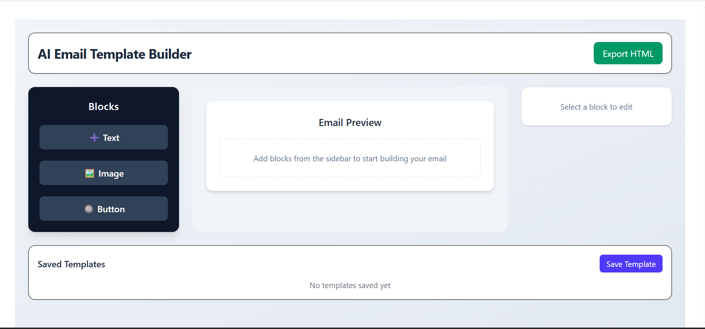
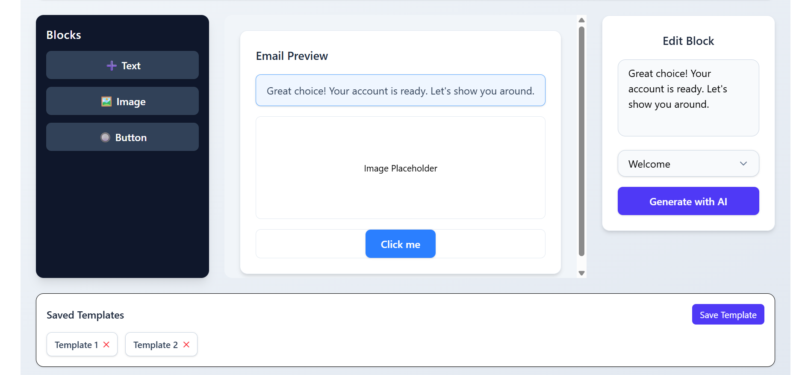
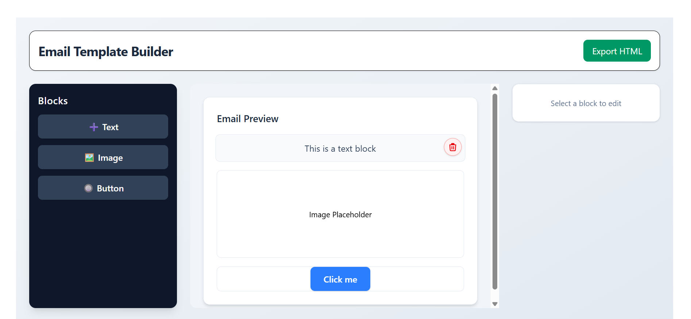

# Email Template Builder 🚀
A responsive web application that allows users to visually build email templates using drag-and-drop blocks. Users can add text, images, and buttons, preview emails in real time, and export the final email as HTML.

## 🔗 Live Demo
👉 https://email-template-builder-app-v2.vercel.app/

## ✨ Features
- Drag & drop email blocks (Text, Image, Button)
- Real-time email preview
- Delete & reorder blocks
- Fully responsive (Mobile, Tablet, Desktop)
- Export email as clean HTML
- Smooth animations using Framer Motion

## 🎯 Use Cases
- Marketing email creation
- Newsletter drafting
- Transactional email layout testing
- Learning drag-and-drop UI patterns


## 📸 Screenshots

### 🏠 Main Interface


### ✏️ Email Editor


### 👀 Email Preview



## 🛠 Tech Stack
- React (Vite)
- Tailwind CSS
- Framer Motion
- JavaScript (ES6+)
- Vercel (Deployment)

## 📦 Installation
```bash
git clone https://github.com/loki-1612/email-template-builder.git
cd email-template-builder
npm install
npm run dev